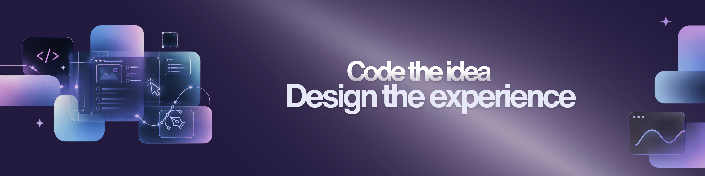

<div align="center">
  
</div>

<br>

<div align="center">

## ✦ About Me

</div>

<p align="center">
  Computer Science Graduate passionate about building useful digital experiences
  through software development and UI/UX design.
  <br>
  I enjoy turning ideas into clean, intuitive and functional digital products.
</p>

<br>

<div align="center">

## ✦ What I Build

| 📱 Mobile Applications | 🎨 UI/UX Experiences | 💻 Software Solutions |
| :---: | :---: | :---: |
| **Flutter & Dart**<br>Cross-platform mobile apps | **Figma & UCD**<br>User-centered designs | **End-to-End**<br>From idea to implementation |

</div>

<br>

---

<div align="center">

## ✦ My Toolkit

<br>


</div>

<br>

---

<div align="center">

## ✦ Development Workflow

```mermaid
graph LR
    A[💡 Idea] --> B[🎨 Design]
    B --> C[💻 Build]
    C --> D[📱 Product]
